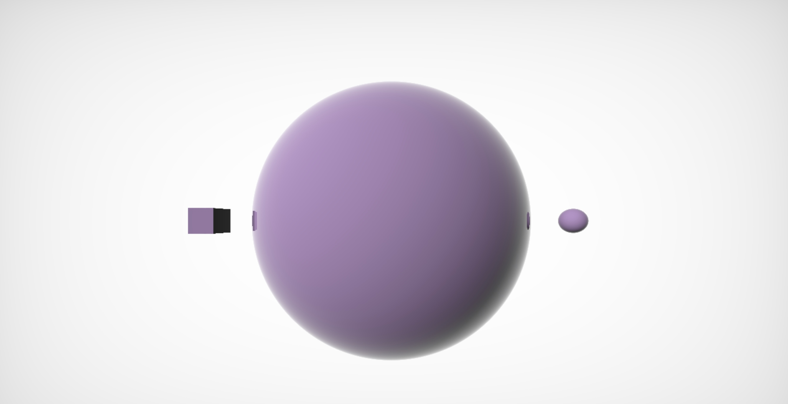

<p align="center">
  
</p>

# React-SDF
A React renderer to help create SDF.  

## Usage

install npm package

```bash
npm install @youyouzone/react-sdf
```

use as a React component

```jsx
import Page from '@youyouzone/react-sdf';

export const App = () => {
  return <Page style={{width:'100%',height:'100vh'}}>
    <sphere
      position={{ x: 0, y: 1, z: 0 }}
      radius={1.0}
      color={{ x: .5, y: .3, z: .6 }}
      diffuse={1}
      specular={0.01}
    />
    <sphere
      position={{ x: -1.5, y: 1, z: 0 }}
      radius={0.1}
      color={{ x: .5, y: .3, z: .6 }}
    />
    <box
      position={{ x: 1.5, y: 1, z: 0 }}
      size={{width:0.1,height:0.1,depth:0.1}}
      color={{ x: .5, y: .3, z: .6 }}
    />
  </Page>
}
```

## Examples
[https://react-sdf.netlify.app]https://react-sdf.netlify.app  

## License
This project is licensed under [](https://opensource.org/licenses/MIT)

## Contact
* Email:[eric199002@icloud.com](eric199002@icloud.com)
* Twitter:[https://twitter.com/nikoniko600](https://twitter.com/nikoniko600)
* Repo:[https://github.com/Eric-Schecter/react-sdf](https://github.com/Eric-Schecter/react-sdf)
* App:[https://react-sdf.netlify.app](https://react-sdf.netlify.app) 