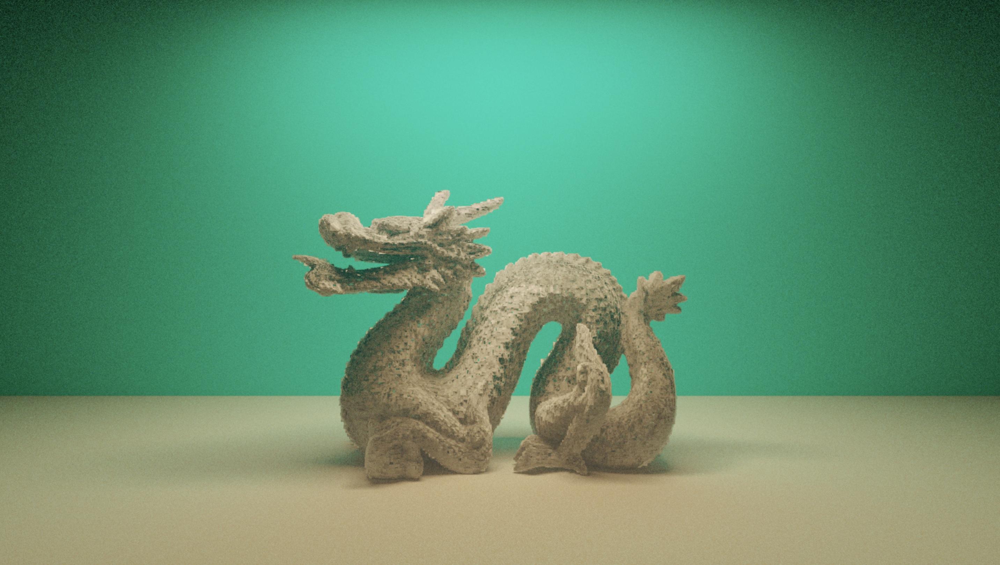

<p align="center">
  
</p>

# Computer-Graphics-Lab
A React renderer for pathtracing.  

## Usage

install npm package

```bash
npm install @youyouzone/react-sdf
```

use as a React component

```jsx
import Page from '@youyouzone/react-sdf';

export const App = () => {
   const rawData = [
    { position: [0, 180, 0], size: [100, 0.01, 25], color: [1.0, 0.7, 0.38], emissive: [10, 10, 10] },
    { position: [0, 201, 0], size: [200, 1, 100], color: [0.7, 0.7, 0.7], },
    { position: [-200, 50, 0], size: [1, 150, 100], color: [1, 0, 0] },
    { position: [200, 50, 0], size: [1, 150, 100], color: [0, 1, 0], roughness: 0.1, metallic: 1 },
    { position: [0, 0, -100], size: [200, 200, 1], color: [0, 1, 1], },
    { position: [0, -100, 0], size: [200, 1, 100], color: [0.7, 0.7, 0.7] },
    { position: [-50, -40, 0], size: [30, 60, 30], color: [0.5, 0.3, 0.6] },
  ]

  return <Page
    style={{ width: '100%', height: '100vh' }}
  >
    <Camera
      position={[0, 50, 250]}
      lookat={[0, 50, 0]}
      rotation={0}
      fov={50 / 180 * Math.PI}
    />
    {rawData.map(({ position, size, color, emissive, roughness, metallic }, i) =>
      <box
        key={i}
        position={position}
        size={size}
        color={color}
        emissive={emissive}
        roughness={roughness}
        metallic={metallic}
      />
    )}
    <sphere
      position={[50, -45, 0]}
      radius={50}
      color={[1, 1, 1]}
      roughness={0}
      specTrans={1}
      specular={0.02}
    />
  </Page>
}
```

## Examples
### demos
[https://cornell-box.netlify.app](https://cornell-box.netlify.app)  
[https://disney-principled.netlify.app](https://disney-principled.netlify.app)  
[https://bvh-example.netlify.app](https://bvh-example.netlify.app)  

### images with bugs
<p align="center">
  
</p>
<p align="center">
  
</p>

[For more samples](https://github.com/Eric-Schecter/computer-graphics-lab/tree/master/errorsamples)  

## License
This project is licensed under [](https://opensource.org/licenses/MIT)

## Contact
* Email:[eric199002@icloud.com](eric199002@icloud.com)
* Twitter:[https://twitter.com/nikoniko600](https://twitter.com/nikoniko600)
* Repo:[https://github.com/Eric-Schecter/react-sdf](https://github.com/Eric-Schecter/react-sdf)